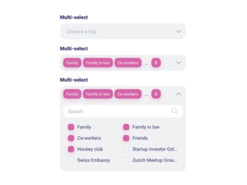
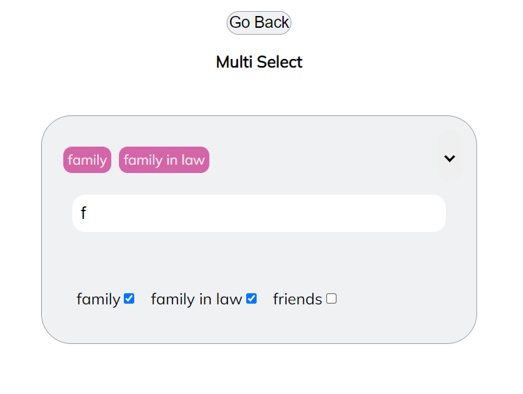

# Multi-Select App React

+ Multiple Select Component is required in React without using external libraries (Multiple Select)

Image is attached:




Created with 
+ *react-app.*
+ *Functional components.*
+ *Pure CSS.*
+ *Without `React-select` libraries and other external component.*


## View Online in Vercel Deployinment (Desktop and responsive desing)
=>
+ [Click Here](https://multi-select-react-challenge.vercel.app/).

# Directions for executing the project

# Install

+ `npm install`.

```
/test-j-multi-select (master)

`npm install` 
or 
`npm i`

```

+ Finally, run the process with `npm start` 

```
/test-j-multi-select (master)
npm start

```

# Preview 

# Home


# Controls Error


## View Online in Vercel Deployinment (Desktop and responsive desing)
=>
+ [Click Here](https://multi-select-react-challenge.vercel.app/).


+ ## Updated with input autocomplete

